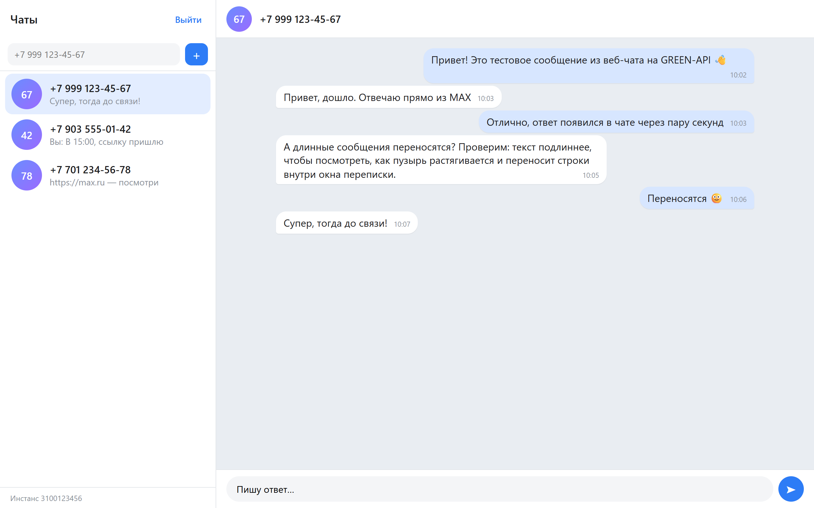
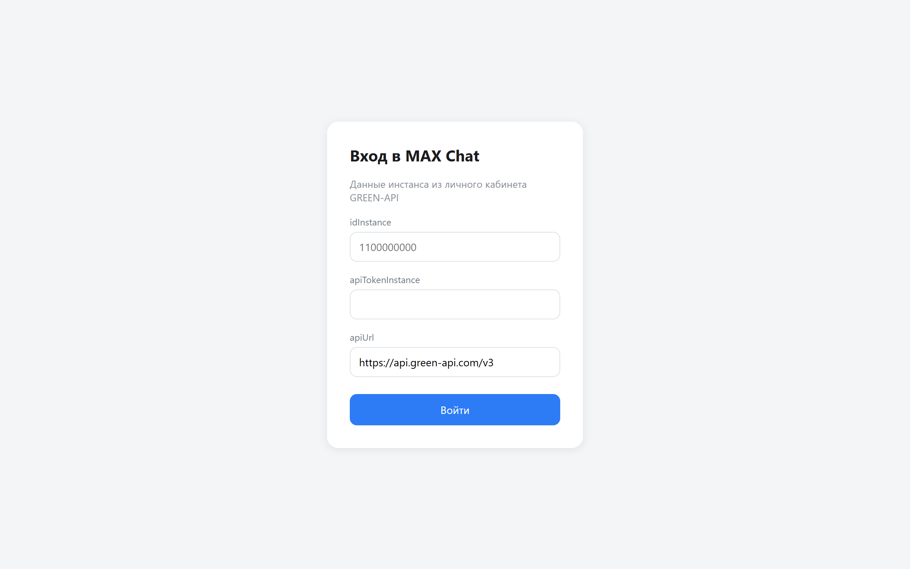
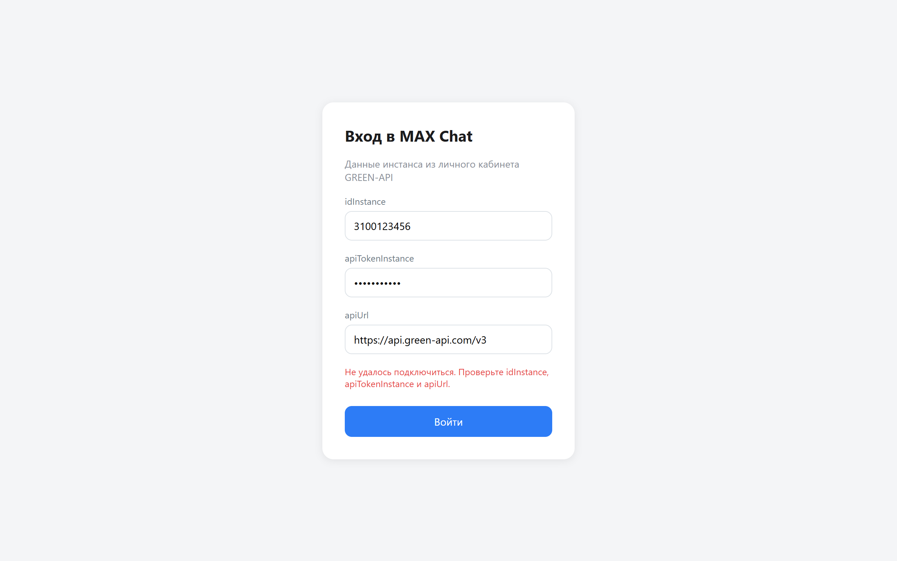
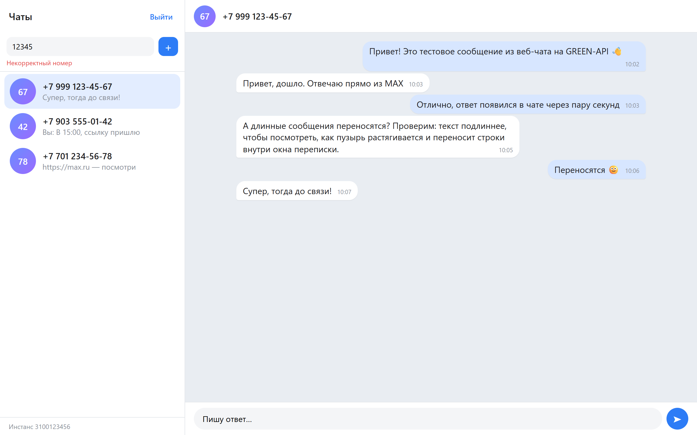
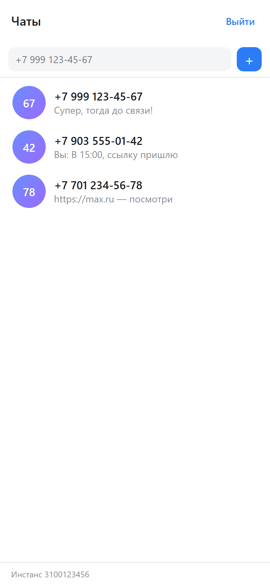
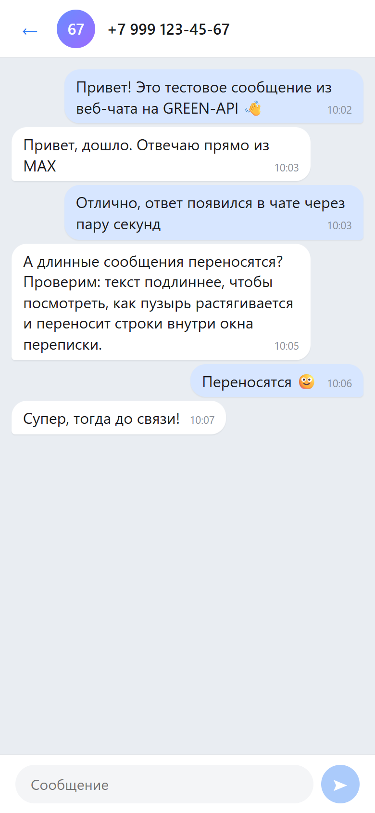

# MAX Chat

[](https://github.com/DmitryKalinin/green-api-test/actions/workflows/deploy.yml)

Веб-интерфейс для отправки и получения текстовых сообщений в мессенджере MAX
через [GREEN-API](https://green-api.com/max). Внешний вид — по мотивам [web.max.ru](https://web.max.ru/).

## Для проверяющего

- [docs/REVIEW.md](docs/REVIEW.md) — требования → код → проверка, сценарий проверки за 5 минут.
- [AGENTS.md](AGENTS.md) — контекст для AI-агентов: команды, карта кода, инварианты.
- [docs/ARCHITECTURE.md](docs/ARCHITECTURE.md) — решения и компромиссы, схема потока данных.
- [docs/GREEN_API.md](docs/GREEN_API.md) — какие методы и уведомления GREEN-API используются.
- [docs/AI_WORKFLOW.md](docs/AI_WORKFLOW.md) — как проект разрабатывался вместе с Claude Code.

## Скриншоты



| Вход                                   | Неверные данные                                      | Некорректный номер                                           |
| -------------------------------------- | ---------------------------------------------------- | ------------------------------------------------------------ |
|  |  |  |

| Телефон: список чатов                                       | Телефон: переписка                                          |
| ----------------------------------------------------------- | ----------------------------------------------------------- |
|  |  |

Скриншоты сняты с этого приложения в Edge (Playwright) на демо-данных: чаты подставлены через
`localStorage`, ответы GREEN-API подменены в браузере, номера вымышленные.

## Возможности

- вход по `idInstance` и `apiTokenInstance` (данные проверяются запросом `getStateInstance`);
- создание чата по номеру телефона (`+7 999 123-45-67`, `8 999…`, `999…` — номер нормализуется);
- отправка текстовых сообщений — [SendMessage](https://green-api.com/v3/docs/api/sending/SendMessage/);
- получение сообщений — [HTTP API](https://green-api.com/v3/docs/api/receiving/technology-http-api/)
  (`ReceiveNotification` + `DeleteNotification`);
- показываются и сообщения, отправленные с телефона;
- чат создаётся автоматически, если написали с нового номера;
- чаты и данные входа сохраняются в `localStorage`, кнопка «Выйти» всё очищает;
- адаптивная вёрстка для телефона.

## Стек

React 19, TypeScript, Redux Toolkit + RTK Query, CSS Modules, Vite, Vitest, ESLint + Prettier.

## Запуск локально

Нужен Node.js 20+.

```bash
git clone https://github.com/DmitryKalinin/green-api-test.git
cd green-api-test
npm ci
npm run dev
```

Приложение откроется на http://localhost:5173.

Другие команды:

```bash
npm run build   # сборка в dist/
npm run preview # просмотр сборки
npm test        # unit-тесты
npm run lint    # ESLint
```

## Настройка инстанса GREEN-API

1. Создайте инстанс для MAX в [личном кабинете](https://console.green-api.com/) и авторизуйте его.
2. В настройках инстанса:
   - поле **URL для получения уведомлений (webhookUrl)** должно быть пустым —
     иначе уведомления уходят на вебхук и не попадают в очередь HTTP API;
   - включите получение входящих уведомлений (`incomingWebhook`)
     и, по желанию, исходящих (`outgoingWebhook`, `outgoingAPIMessageWebhook`).
3. На странице входа укажите `idInstance`, `apiTokenInstance` и `apiUrl`
   (по умолчанию `https://api.green-api.com/v3`; если в кабинете указан другой хост — используйте его).

## Как это работает

Кратко: RTK Query собирает URL GREEN-API из данных инстанса в сторе, входящие получаются
последовательным long polling (`receiveNotification` → обработка → `deleteNotification`).
Подробности и обоснования — в [docs/ARCHITECTURE.md](docs/ARCHITECTURE.md).

## Ограничения

- поддерживаются только текстовые сообщения (по условию задания);
- история переписки не подгружается с сервера — видны сообщения, полученные после входа;
- `apiTokenInstance` хранится в `localStorage` браузера.
