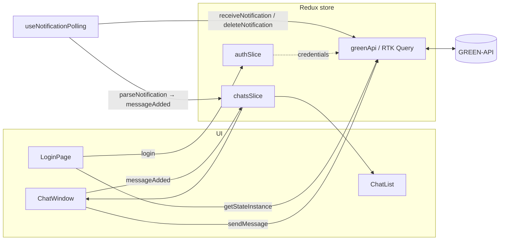

# Архитектура

## Поток данных

## Решения

### RTK Query с baseQuery, который берёт данные инстанса из стора

**Контекст.** URL любого метода GREEN-API содержит `idInstance` и `apiTokenInstance`:
`{apiUrl}/waInstance{idInstance}/{method}/{apiTokenInstance}`.

**Решение.** Свой `baseQuery` в [`greenApi.ts`](../src/api/greenApi.ts) читает креденшелы из
`authSlice` и собирает URL. Эндпоинты описывают только метод и тело.
Исключение — `getStateInstance`: он вызывается до входа, поэтому получает креденшелы аргументом.

**Почему.** Компоненты не знают о токенах и формате URL; первая версия на `fetch` с передачей
креденшелов в каждый вызов была переписана (коммит `refactor: move api to RTK Query`).

### Получение сообщений: последовательный long polling

**Контекст.** `receiveNotification` держит соединение до `receiveTimeout` (5 с) и отдаёт одно
уведомление; после обработки его нужно удалить `deleteNotification`, иначе оно вернётся снова.

**Решение.** В [`useNotificationPolling.ts`](../src/hooks/useNotificationPolling.ts) — цикл
`while`: получить → обработать → удалить → следующий запрос. При ошибке — пауза 5 с.

**Почему.** Первая версия на `setInterval(3s)` запускала запросы внахлёст: пока один висел
5 секунд, стартовали следующие, одно уведомление обрабатывалось дважды. История итераций видна
в коммитах: `feat: polling receiveNotification` → `fix: delete notification after receive` →
`fix: sequential notification polling, handle StrictMode remount`.

### Остановка цикла и дедупликация

**Контекст.** В dev-режиме React StrictMode монтирует эффекты дважды. Первый цикл получает
флаг остановки, но его запрос уже в полёте и может обработать уведомление параллельно со вторым.

**Решение.** При размонтировании — `abort()` текущего запроса и проверка флага сразу после
`await`. Дополнительно `messageAdded` игнорирует сообщение с уже известным `idMessage`.

**Почему.** Дедупликация нужна и в production: отправленное из приложения сообщение
возвращается уведомлением `outgoingAPIMessageReceived` с тем же `idMessage`.

### Разбор уведомлений — чистая функция

[`parseNotification`](../src/utils/parseNotification.ts) превращает уведомление в `Message` или
`null`. Никаких зависимостей от React и стора, поэтому покрыта unit-тестами на все типы:
входящее, `extendedTextMessage` (ответы с телефона со ссылками/цитатами), исходящее с
телефона, медиа и служебные уведомления.

### Состояние и хранение

- `authSlice` — креденшелы; `chatsSlice` — чаты, сообщения по `chatId`, активный чат.
- `auth` и `chats` сохраняются в `localStorage` ([`persist.ts`](../src/app/persist.ts)),
  при старте восстанавливаются через `preloadedState`.
- `logout` сбрасывает всё состояние и очищает хранилище в корневом редьюсере
  ([`store.ts`](../src/app/store.ts)), чтобы чаты одного инстанса не показались другому.

### Вёрстка

CSS Modules, тема — CSS-переменные в [`index.css`](../src/index.css). На ширине ≤ 700px
показывается либо список, либо открытый чат с кнопкой «назад» (класс `chatOpen` в `Layout`).

### Сборка и деплой

`base: './'` в [`vite.config.ts`](../vite.config.ts) — относительные пути, сборка работает из
подпапки `https://<user>.github.io/<repo>/`. Workflow
[`deploy.yml`](../.github/workflows/deploy.yml) при пуше в `main`: `npm ci` → lint → test →
build → публикация на GitHub Pages.
